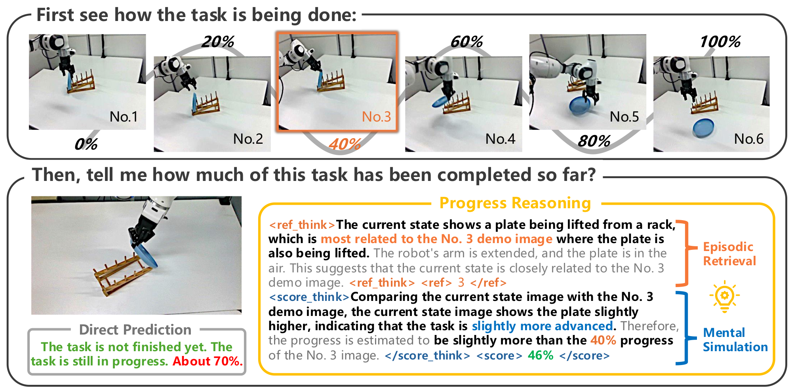

<h1 align="center">
  &nbsp;ProgressLM: Towards Progress Reasoning in Vision-Language Models
</h1>

<p align="center">
  Jianshu Zhang*, Chengxuan Qian*, Haosen Sun, Haoran Lu, Dingcheng Wang, Letian Xue, Han Liu
  <br>
  <i>(* equal contribution)</i>
</p>

<p align="center">
  <a href="https://progresslm.github.io/ProgressLM/"></a>
  <a href="https://github.com/ProgressLM/ProgressLM/blob/main/public/ProgressLM_Tech_Report.pdf"></a>
  <a href="https://huggingface.co/Raymond-Qiancx/ProgressLM-3B-SFT"></a>
  <a href="https://huggingface.co/Raymond-Qiancx/ProgressLM-3B-RL"></a>
  <a href="https://huggingface.co/datasets/Raymond-Qiancx/ProgressLM-Dataset"></a>
</p>

<p align="center">
  
</p>

<p align="justify">
Given a task demonstration and a single observation, the goal is to estimate <b>how much of the task has already been completed</b>. Direct prediction can often judge whether the task is unfinished, but struggles to assign a well-calibrated progress score. Progress reasoning instead follows a coarse-to-fine process: it first performs <b>episodic retrieval</b> to coarsely locate the observation along the demonstrated task, then applies <b>mental simulation</b> to imagine the transition from the retrieved anchor to the current observation, enabling a fine-grained estimate of completed progress.
</p>

<p align="justify">
<b><i>Can vision-language models acquire progress estimation as a general reasoning capability from a single observation?</i></b> To systematically study this question, we select robotic manipulation tasks as a controlled and representative domain, where task execution exhibits clear, interpretable, and temporally ordered progressions. Each instance provides a task <i>demonstration</i> and a single <i>observation</i>, and the model is required to predict a normalized <i>progress score</i> indicating how far the task has progressed.
</p>

<p align="center">
  
</p>

<p align="justify">
Progress annotated data is constructed along three key dimensions.
<b>(i) Demonstration modality</b> compares vision-based demonstrations that present state trajectories with text-based demonstrations that provide step-by-step action descriptions.
<b>(ii) Viewpoint correspondence</b> controls whether demonstrations and observations are captured from the same camera viewpoint or from different viewpoints.
<b>(iii) Answerability</b> explicitly distinguishes between cases where progress is well-defined and cases where reliable estimation is inherently ambiguous.
This design allows us to disentangle perception, temporal reasoning, and uncertainty awareness in progress estimation.
</p>

### Overview of ProgressLM-Dataset

<p align="center">
  
</p>

<p align="justify">
Data statistics of <b>Progress-Bench</b> and <b>ProgressLM-45K</b> (25K for SFT while 20K for RL). Traj and Samp denote the numbers of task trajectories and sampled observations to be estimated, respectively. The upper-right panel shows the four distinct robotic embodiments included, while the lower-right panel visualizes the diversity of objects involved in task interactions.
</p>


## Installation


### SFT Environment

We use [LLaMA-Factory](https://github.com/hiyouga/LLaMA-Factory) for supervised fine-tuning. It supports LoRA, QLoRA, and full fine-tuning with various model architectures including Qwen2.5-VL.

```bash
conda create -n progsft python=3.11 -y
conda activate progsft
cd LLaMA-Factory
pip install -e ".[torch,metrics]"
```


### RL Environment

We use [EasyR1](https://github.com/hiyouga/EasyR1) for reinforcement learning with GRPO (Group Relative Policy Optimization). It provides distributed training support with FSDP and efficient rollout generation.

```bash
conda create -n progrl python=3.11 -y
conda activate progrl
cd EasyR1
pip install -e .
```


### Evaluation Environment

```bash
conda create -n progresslm python=3.11 -y
conda activate progresslm
pip install -r eval/requirement.txt
```

## Datasets

### prog-bench

Programmatic task benchmarks for progress reasoning evaluation.

| File | Description |
|------|-------------|
| `text-normal.jsonl` | Text demonstration normal samples |
| `text-unanswerable.jsonl` | Unanswerable text samples |
| `visual_same_view.jsonl` | Same-view visual demonstrations |
| `visual_cross_view.jsonl` | Cross-view visual demonstrations |
| `visual-unanswerable.jsonl` | Unanswerable visual samples |

### human-bench

Human activity benchmarks for progress reasoning evaluation.

| File | Description |
|------|-------------|
| `text_demo_human_activities.jsonl` | Text demonstrations of human activities |
| `visual_demo_human_activities.jsonl` | Visual demonstrations of human activities |

## SFT Training


### Configuration Files

| Config File | Description |
|-------------|-------------|
| `qwen2_5vl_lora_sft_small.yaml` | Qwen2.5-VL-3B LoRA SFT config |
| `qwen2_5vl_lora_sft_7b.yaml` | Qwen2.5-VL-7B LoRA SFT config |
| `qwen3vl_4b_lora_sft.yaml` | Qwen3-VL-4B LoRA SFT config |

### Running SFT Training

```bash
cd LLaMA-Factory

# Qwen2.5-VL-3B (Single GPU)
bash our_scripts/train_qwen2_5vl_lora_sft.sh

# Qwen2.5-VL-3B (Multi GPU)
CUDA_VISIBLE_DEVICES=0,1,2,3 bash our_scripts/train_qwen2_5vl_lora_sft.sh

# Qwen2.5-VL-7B
bash our_scripts/train_qwen2_5vl_lora_sft_7b.sh

# Qwen3-VL-4B
bash our_scripts/train_qwen3vl_4b_lora_sft.sh
```

### Merge LoRA Weights

After SFT training, merge LoRA weights into the base model:

```bash
# Merge Qwen2.5-VL-3B LoRA
llamafactory-cli export LLaMA-Factory/our_scripts/merge_qwen2_5vl_lora.yaml

# Merge Qwen2.5-VL-7B LoRA
llamafactory-cli export LLaMA-Factory/our_scripts/merge_qwen25vl_7b_lora.yaml
```

### Key SFT Parameters

| Parameter | Description | Example |
|-----------|-------------|---------|
| `model_name_or_path` | Base model path | `Qwen/Qwen2.5-VL-3B-Instruct` |
| `dataset` | Training dataset name | `progresslm_think` |
| `output_dir` | Output directory | `/path/to/output` |
| `lora_rank` | LoRA rank | `8` |
| `lora_alpha` | LoRA alpha | `16` |
| `learning_rate` | Learning rate | `1.0e-4` |
| `num_train_epochs` | Training epochs | `3.0` |
| `per_device_train_batch_size` | Batch size per GPU | `2` |
| `gradient_accumulation_steps` | Gradient accumulation | `8` |


### Scaling more CoT Data?

**Step 1: Generate CoT responses using Qwen2.5-VL**

```bash
cd eval/qwen25vl/scripts/cot_gen

# Generate CoT for Text Demo data
MODEL_PATH=/path/to/Qwen2.5-VL-32B-Instruct \
DATASET_PATH=/path/to/text_demo.jsonl \
IMAGE_ROOT=/path/to/images \
OUTPUT_DIR=/path/to/output \
GPU_IDS=0,1,2,3 \
BATCH_SIZE=5 \
bash think_text_demo.sh

# Generate CoT for Visual Demo data
MODEL_PATH=/path/to/Qwen2.5-VL-32B-Instruct \
DATASET_PATH=/path/to/visual_demo.jsonl \
IMAGE_ROOT=/path/to/images \
OUTPUT_DIR=/path/to/output \
GPU_IDS=0,1,2,3 \
BATCH_SIZE=2 \
bash think_visual_demo.sh
```

**Environment Variables:**

| Variable | Description | Default |
|----------|-------------|---------|
| `MODEL_PATH` | Path to Qwen2.5-VL model | Required |
| `DATASET_PATH` | Input JSONL dataset path | Required |
| `IMAGE_ROOT` | Root directory for images | Required |
| `OUTPUT_DIR` | Output directory for results | Required |
| `GPU_IDS` | Comma-separated GPU IDs | `0,1,2,3` |
| `BATCH_SIZE` | Batch size per GPU | `5` (text) / `2` (visual) |
| `NUM_INFERENCES` | Inferences per sample | `1` |
| `TEMPERATURE` | Sampling temperature | `0.6` |
| `LIMIT` | Limit samples (-1 for all) | `-1` |

We also provide scripts for **Qwen2.5-VL-72B** with multi-GPU model parallelism:

```bash
# 72B model for Text Demo (requires 4+ GPUs for model parallelism)
MODEL_PATH=/path/to/Qwen2.5-VL-72B-Instruct \
DATASET_PATH=/path/to/text_demo.jsonl \
GPU_IDS=0,1,2,3 \
BATCH_SIZE=40 \
bash think_text_demo_72b.sh

# 72B model for Visual Demo
MODEL_PATH=/path/to/Qwen2.5-VL-72B-Instruct \
DATASET_PATH=/path/to/visual_demo.jsonl \
GPU_IDS=0,1,2,3 \
BATCH_SIZE=20 \
bash think_visual_demo_72b.sh
```

**Step 2: Convert CoT responses to LLaMA-Factory format**

```bash
cd LLaMA-Factory/our_scripts/data_convert

# Convert Text Demo data
python convert_text_demo.py \
    --original-data /path/to/text_demo.jsonl \
    --cot-responses /path/to/cot_responses.jsonl \
    --output-file /path/to/output.json \
    --filter-success

# Convert Visual Demo data
python convert_visual_demo.py \
    --original-data /path/to/visual_demo.jsonl \
    --cot-responses /path/to/cot_responses.jsonl \
    --output-file /path/to/output.json \
    --filter-success

# Batch convert and merge all datasets
bash run_convert_and_merge.sh
```


## RL Training (GRPO)

### Configuration Files

| Config File | Description |
|-------------|-------------|
| `configs/visual_demo_grpo.yaml` | Qwen2.5-VL-3B GRPO config |
| `configs/visual_demo_grpo_7b.yaml` | Qwen2.5-VL-7B GRPO config |
| `configs/multinodes.yaml` | Multi-node training config |

### Running RL Training

```bash
cd EasyR1

# Qwen2.5-VL-3B (Single Node)
bash progresslm/run_grpo_3b.sh

# Qwen2.5-VL-3B (Multi Node)
bash progresslm/run_grpo_3b_multinode.sh

# Qwen2.5-VL-7B
bash progresslm/run_grpo_7b.sh
```

### Key RL Parameters

| Parameter | Description | Example |
|-----------|-------------|---------|
| `worker.actor.model.model_path` | SFT model path | `/path/to/sft_model` |
| `trainer.save_checkpoint_path` | Checkpoint path | `/path/to/rl_ckpt` |
| `algorithm.kl_coef` | KL penalty coefficient | `1.0e-2` |
| `algorithm.kl_target` | Target KL divergence | `0.1` |
| `worker.rollout.n` | Number of rollouts | `4` |
| `worker.rollout.temperature` | Sampling temperature | `0.6` |
| `worker.actor.optim.lr` | Learning rate | `1.0e-6` |
| `trainer.total_epochs` | Training epochs | `2` |

## Evaluation

### Supported Models

| Model | Directory | Description |
|-------|-----------|-------------|
| Qwen2.5-VL | `eval/qwen25vl/` | Qwen2.5-VL series (3B, 7B, 72B) |
| Qwen3-VL | `eval/qwen3vl/` | Qwen3-VL series |
| InternVL | `eval/internvl/` | InternVL series |
| OpenAI GPT | `eval/openai/` | GPT-4V, GPT-4o via API |

### Benchmark Scripts

Evaluation scripts are organized in `eval/qwen25vl/scripts/benchmarks/`:

| Benchmark | Description | Scripts |
|-----------|-------------|---------|
| `normal_text/` | Text demonstration (normal) | `eval_text_normal_sft_3b.sh`, `eval_text_normal_rl_3b.sh`, ... |
| `normal_view/` | Visual demonstration (same view) | `visual_eval_one_view_3B_SFT.sh`, `visual_eval_one_view_3B_RL.sh`, ... |
| `multi_view/` | Visual demonstration (cross view) | Multi-view evaluation scripts |
| `nega_text/` | Text unanswerable samples | Negative text evaluation scripts |
| `edit_nega/` | Visual unanswerable samples | Negative visual evaluation scripts |
| `human/` | Human activity benchmarks | Human activity evaluation scripts |

### Running Evaluation

#### Text Demo Evaluation (prog-bench)

```bash
cd eval/qwen25vl/scripts/benchmarks/normal_text

# SFT Model (3B)
bash eval_text_normal_sft_3b.sh

# RL Model (3B)
bash eval_text_normal_rl_3b.sh

# SFT Model (7B)
bash eval_text_normal_sft_7b.sh

# Large Models (72B)
bash eval_text_normal_72b.sh
```

#### Visual Demo Evaluation (prog-bench)

```bash
cd eval/qwen25vl/scripts/benchmarks/normal_view

# SFT Model (3B)
bash visual_eval_one_view_3B_SFT.sh

# RL Model (3B)
bash visual_eval_one_view_3B_RL.sh

# SFT Model (7B)
bash visual_eval_one_view_7B_SFT.sh

# Large Models (72B)
bash visual_eval_one_view_72B.sh
```

#### Human Activity Evaluation (human-bench)

```bash
cd eval/qwen25vl/scripts/benchmarks/human

# Text Demo - Human Activities
bash text_eval_human_rl_3b.sh

# Visual Demo - Human Activities
bash visual_eval_human_3B_RL.sh
```

#### Nothink Mode Evaluation

For models without thinking process:

```bash
# Text Demo Nothink
cd eval/qwen25vl/scripts/benchmarks/normal_text
bash nothink_3b.sh
bash nothink_7b.sh
bash nothink_72b.sh

# Visual Demo Nothink
cd eval/qwen25vl/scripts/benchmarks/normal_view
bash visual_eval_one_view_nothink_3B.sh
bash visual_eval_one_view_nothink_7B.sh
bash visual_eval_one_view_nothink_72B.sh
```

### Manual Evaluation Command

```bash
cd eval/qwen25vl/codes

# Text Demo Evaluation
python run_text_demo.py \
    --model-path /path/to/model \
    --dataset-path /path/to/text_demo.jsonl \
    --output-file /path/to/results.jsonl \
    --image-root /path/to/images \
    --batch-size 100 \
    --temperature 0.6 \
    --max-new-tokens 40000

# Visual Demo Evaluation
python run_visual_demo.py \
    --model-path /path/to/model \
    --dataset-path /path/to/visual_demo.jsonl \
    --output-file /path/to/results.jsonl \
    --image-root /path/to/images \
    --batch-size 50 \
    --temperature 0.6 \
    --max-new-tokens 40000

# Nothink Mode
python run_text_demo_nothink.py \
    --model-path /path/to/model \
    --dataset-path /path/to/text_demo.jsonl \
    --output-file /path/to/results.jsonl

python run_visual_demo_nothink.py \
    --model-path /path/to/model \
    --dataset-path /path/to/visual_demo.jsonl \
    --output-file /path/to/results.jsonl
```

### Evaluation Metrics

| Metric | Description |
|--------|-------------|
| **VOC** | Trajectory Order Consistency - Spearman correlation of predicted progress order |
| **Score Error** | Normalized error of predicted progress score |
| **Ref Error** | Normalized error of predicted reference step index |
| **N/A Recall** | Recall for unanswerable samples (predicting "n/a" correctly) |

### Other Model Evaluation

#### Qwen3-VL

We support Qwen3-VL series models (2B, 4B, 8B, 32B, 30B-MoE) with both thinking and non-thinking modes:

```bash
cd eval/qwen3vl/scripts

# Run all benchmarks for a specific model size
bash run_all/run_8b.sh          # Qwen3-VL-8B with thinking
bash run_all/run_8b_nothink.sh  # Qwen3-VL-8B without thinking

# Or run specific benchmarks
bash normal_text/qwen3vl_8b.sh   # Text Demo evaluation
bash normal_view/qwen3vl_8b.sh   # Visual Demo evaluation
bash nega_text/qwen3vl_8b.sh     # Negative Text evaluation
bash multi_view/qwen3vl_8b.sh    # Multi-view evaluation
```

**Available Model Sizes:**

| Model | Script Suffix | Parameters |
|-------|---------------|------------|
| Qwen3-VL-2B | `_2b.sh` | 2B |
| Qwen3-VL-4B | `_4b.sh` | 4B |
| Qwen3-VL-8B | `_8b.sh` | 8B |
| Qwen3-VL-32B | `_32b.sh` | 32B |


Add `_nothink` suffix for non-thinking mode (e.g., `qwen3vl_8b_nothink.sh`).

#### InternVL

```bash
cd eval/internvl/codes
python run_text_demo.py --model-path /path/to/internvl --dataset-path /path/to/data.jsonl
python run_visual_demo.py --model-path /path/to/internvl --dataset-path /path/to/data.jsonl
```

#### OpenAI API

```bash
cd eval/openai/codes
export OPENAI_API_KEY=your_api_key
python run_text_demo.py --dataset-path /path/to/data.jsonl
python run_visual_demo.py --dataset-path /path/to/data.jsonl
```

## Citation

If you find this work useful, please cite our paper:

```bibtex
@article{zhang2025progresslm,
  title={ProgressLM: Towards Progress Reasoning in Vision-Language Models},
  author={Zhang, Jianshu and Qian, Chengxuan and Sun, Haosen and Lu, Haoran and Wang, Dingcheng and Xue, Letian and Liu, Han},
  year={2025}
}
```
